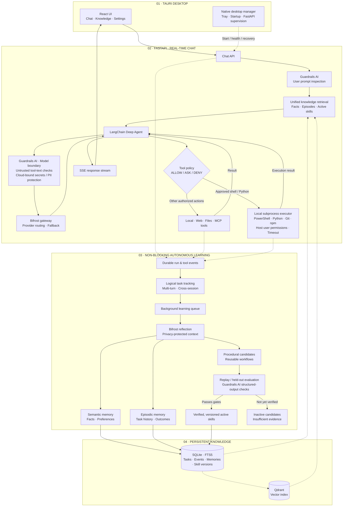

<p align="center">
  
</p>

<h1 align="center">Trajecta</h1>

<p align="center"><strong>A desktop AI agent that learns from experience.</strong></p>

<p align="center">Chat · Tools · Knowledge · Background learning · Human control</p>

---

> **Status:** Active development.

## Overview

Trajecta is a Tauri 2 desktop application with a Python/FastAPI agent backend. It can execute multi-step tasks, search stored knowledge, and learn from prior interactions while keeping sensitive tool actions behind explicit permissions.

- **Act:** LangChain Deep Agents, local tools, MCP integrations, Docker-free local command execution, and user-selected models.
- **Remember:** Saved facts, prior task experiences, document context, and reusable skills.
- **Learn:** A durable background worker links related chat runs into logical tasks and generates evidence-backed insights and skill candidates.
- **Protect:** Guardrails AI checks prompt injection, untrusted tool content, and sensitive context before cloud-model calls.
- **Control:** `ALLOW / ASK / DENY` permissions remain in force even when knowledge is created automatically.

## Features

- **Desktop chat:** SSE streaming, expandable reasoning/tool activity, branching and regeneration, message editing, and stop/cancellation handling.
- **Tools & workspaces:** Local files, web and document tools, MCP integrations, and per-conversation folder selection.
- **Docker-free local commands:** Deep Agents `execute` uses the installed Windows PowerShell and other tools via Python subprocess, with terminal approval and timeouts. **Commands are not sandboxed:** they can access host files and network resources as the current user.
- **Knowledge Center:** Semantic memory (facts/preferences), episodic memory (task history), and procedural memory (versioned skills).
- **Autonomous learning:** Multi-turn task tracking, background reflection, procedural candidate synthesis, and evidence-aware consolidation without routine review prompts.
- **Skill quality controls:** Independent replay/held-out evaluation and safety checks gate activation; unverified candidates remain inactive.
- **Guardrails AI:** Configurable prompt-injection detection, protection from instructions in untrusted tool results, cloud-bound secret/PII redaction, and structured-output validation.
- **Models:** Choose the chat/default/reflection model in Trajecta. Manage cloud/Ollama/9Router providers, API keys, routing, fallbacks, and virtual keys in the Bifrost dashboard.
- **Automation:** One-time, interval, and cron scheduled tasks.
- **Desktop lifecycle:** One global `trajecta` launcher, system tray, optional login startup, managed FastAPI, and in-app Git-based updates/diagnostics.

## LLM gateway ownership

**Bifrost is Trajecta's model gateway, not a second provider-configuration UI.**

- Open **Bifrost Dashboard** in the sidebar (or **Settings → LLM Gateway & Models → Open Bifrost dashboard**) to configure providers, credentials, upstream endpoints, virtual keys, routing rules, budgets and fallback chains. The link uses the gateway URL configured for this installation.
- Choose the model for **new conversations** in Trajecta Settings. Select a model discovered from Bifrost or enter an explicit `provider/model` ID or a Bifrost-managed bare model ID/routing alias. Existing conversations retain their previously selected model. Reflection settings can use a different model.
- Trajecta's `GET /api/v1/llm` only reports gateway diagnostics and the default model. `PUT /api/v1/llm/default` changes **only the default model**; it does not edit Bifrost's providers. The former provider-create/delete/test endpoints are no longer offered by Trajecta.
- The Windows installer creates a unique, persistent Trajecta virtual key at `%LOCALAPPDATA%\ai.trajecta.desktop\data\bifrost\virtual-key` and seeds `data/bifrost/config.json` with only Trajecta's governance entry. On upgrades it retains providers, other virtual keys and routing settings. The Tauri launcher passes the **same** key to Bifrost and FastAPI. An externally managed Bifrost instance still requires a matching `BIFROST_VIRTUAL_KEY` registered in that instance.
- Bifrost's actual routing and failover policies depend on its configuration and your virtual key's permitted providers. The managed key uses `allow_all_providers: true`; this does **not** authorize revoked API keys in upstream providers. Bare-model automatic resolution requires a compatible Bifrost version; otherwise use explicit `provider/model` IDs.

### Troubleshooting 9Router 401

If Bifrost returns `is_bifrost_error: false`, `provider: 9router`, `type: access_not_found`, and `error_type: policy_access_denied`, **9Router or the upstream account has rejected a credential after Bifrost routing**. Recreating Trajecta's virtual key does not resolve it. In Bifrost Dashboard → Providers → 9router, configure the real API key generated by 9Router. In 9Router's dashboard, verify that the requested model is supported and its upstream account is connected. Test with a direct call to `http://127.0.0.1:20128/v1/chat/completions` using the 9Router API key: if it returns the same 401, fix 9Router/upstream credentials before trying Trajecta again. Never paste keys into chat or logs.

## Architecture



The chat response **does not wait for task classification, reflection, or skill evaluation**. Individual runs retain their event history, while logical tasks can continue across turns or sessions. Task association currently uses conservative heuristics rather than perfect semantic understanding. Inactivity can checkpoint a task without marking it successful.

## Install from a Git clone (Windows)

### Prerequisites

- Windows 10/11 and Microsoft Edge WebView2.
- Git, Node.js 22+, pnpm, and [uv](https://docs.astral.sh/uv/).
- Rust toolchain with the MSVC target and Visual Studio C++ build tools (for Tauri); see [Tauri 2 prerequisites](https://v2.tauri.app/start/prerequisites/).
- Internet access to download dependencies on first installation. `uv` provisions Python 3.11 for the managed backend.
- Model credentials configured in the **Bifrost** dashboard for AI chat. The Windows installer provisions a managed gateway launcher and a persistent Trajecta virtual key; the gateway executable downloads on first launch.

### First installation

Run these in PowerShell (replace the repository URL with your actual Git remote):

```powershell
git clone https://github.com/cRED-f/Trajecta.git
cd Trajecta
pnpm trajecta:install
trajecta
```

### Persistent data and updates

The installed application uses an isolated writable directory rather than storing live data inside the source checkout:

```text
%LOCALAPPDATA%\ai.trajecta.desktop\
├── runtime\Trajecta.exe         # Locally compiled desktop executable
├── runtime\venv\                # Managed Python backend
├── data\.trajecta\              # Conversations, SQLite, Qdrant, skills and uploads
├── logs\backend.log             # FastAPI startup/runtime diagnostics
├── desktop.json                 # Desktop preferences
└── install.json                 # Git checkout reference
```

**Settings → Local Execution** lets you enable/disable command execution and configure a timeout. Commands run directly on the host with your user permissions: the selected folder is a working directory, **not** a filesystem or network restriction. Keep **Permissions → Run commands** on ASK.

**Settings → Desktop & Application → Check for updates** inspects the configured Git branch; **Update & restart** pulls and rebuilds from the clone. Commit or stash local changes first. The updater keeps previous runtime artifacts as rollback backups and retains production data, but schema migrations and data backups still require care.

Development and installed Trajecta should **never share live SQLite/Qdrant files**. Historical `.trajecta` data is not silently migrated from an old checkout. Back it up consistently with the old backend stopped before moving it. See [SOURCE_INSTALL.md](SOURCE_INSTALL.md) for details, limitations, and uninstall behavior.

## Repository layout

```text
Trajecta/
├── apps/desktop/            # React / Tauri desktop app and settings
├── cli/                     # Single global trajecta launcher
├── scripts/                 # Local install, update, and uninstall helpers
├── server/src/
│   ├── api/                 # FastAPI endpoints
│   ├── chat/                # Conversation and streaming orchestration
│   ├── guardrails/          # Guardrails AI content/privacy checks and tool policy
│   ├── memory/              # Task tracking, reflection, retrieval and storage
│   ├── skills/              # Candidates, evaluation, promotion and rollback
│   ├── tools/               # Local tools and MCP integrations
│   └── llm_gateway/         # Bifrost integration
├── config/                  # Defaults and guardrail rules
├── pyproject.toml
└── SOURCE_INSTALL.md
```

## Further documentation

- [Source installation and recovery](SOURCE_INSTALL.md)
- [Desktop](apps/desktop/REQUIREMENTS.md) · [Backend](server/REQUIREMENTS.md)
- [Memory](server/src/memory/REQUIREMENTS.md) · [Skills](server/src/skills/REQUIREMENTS.md)
- [Guardrails](server/src/guardrails/REQUIREMENTS.md) · [Tools](server/src/tools/REQUIREMENTS.md)
- [LLM gateway](server/src/llm_gateway/REQUIREMENTS.md) · [Observability](server/src/observability/REQUIREMENTS.md)

## License

[MIT](LICENSE)
