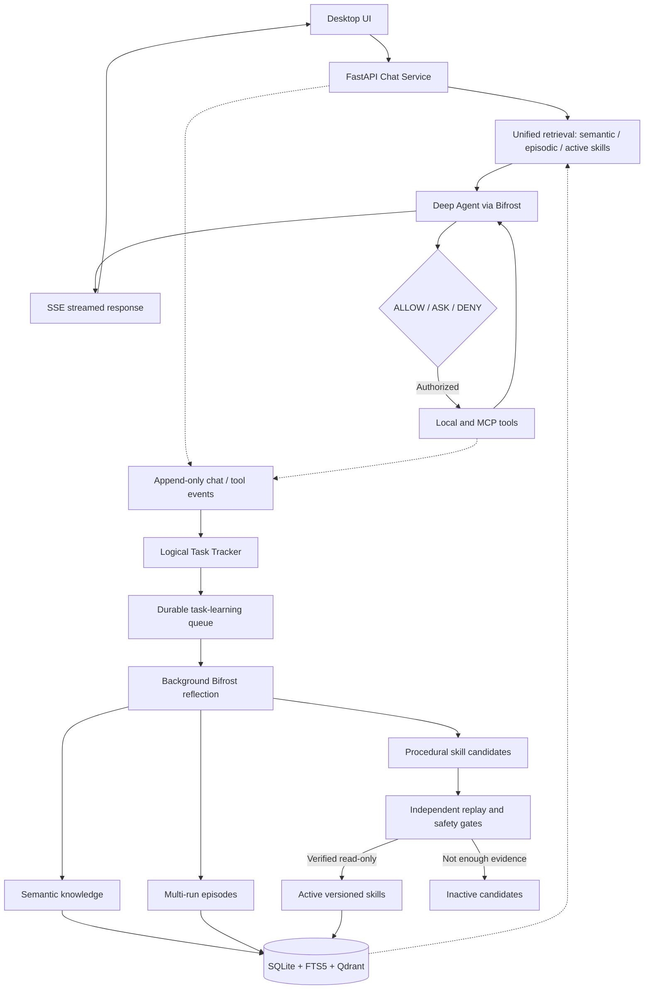

<p align="center">
  
</p>

<h1 align="center">Trajecta</h1>

<p align="center"><strong>A desktop AI agent that learns from experience.</strong></p>

<p align="center">
  Chat · Tools · Knowledge · Automation · Human control
</p>

---

## Overview

**Trajecta** combines a desktop workspace, agentic execution, and persistent learning.

- **Act:** Run multi-step tasks using local tools, MCP integrations, and selected AI models.
- **Remember:** Retrieve relevant preferences, facts, previous tasks, and documents.
- **Improve:** Learn from multi-turn tasks and generate evidence-linked skill candidates automatically.
- **Stay in control:** Approve sensitive tool actions; safe learning runs without routine approval.

> **Status:** Active development.

## Features

- **Desktop chat:** Streaming, conversation history, edit/resend/regenerate, branching, cancellation.
- **Agent runtime:** LangChain Deep Agents, LangGraph checkpoints, subagents, resumable approvals.
- **Knowledge Center:** Overview, Memories, and Skills with optional diagnostics.
- **Learning:** Semantic facts, task-level episodes, autonomous candidates, bounded background reflection.
- **Memory & RAG:** Semantic, episodic, procedural, attachment search, hybrid retrieval.
- **Local workspaces:** Select and validate a folder for each conversation.
- **Models:** Bifrost routing for OpenAI, Anthropic, Ollama, 9Router, and compatible APIs.
- **Tools:** Web, documents, files, local utilities, MCP, optional Docker sandbox.
- **Safety:** Context guardrails, `allow / ask / deny`, human questions and approvals.
- **Scheduling:** One-time, recurring, and cron tasks that retain agent permissions.

## Architecture



Chat streaming never waits for task classification LLMs, reflection or skill evaluation. Task associations use bounded SQLite heuristics; unresolved cases become new logical tasks. A chat completion is provisional, **not proof of success**. Candidates lacking independent verification remain inactive, and all tool permissions are unchanged.

**Migration:** schema v22 adds logical-task linkage and durable `task_learning_jobs`. Legacy `reflection_jobs` and `procedure_drafts` records remain stored but are no longer read by active pipelines. Back up `.trajecta/data` before upgrading.

## How learning works

1. **Capture** — conversation, tool activity, outcome evidence, and feedback.
2. **Extract** — explicit preferences, corrections, and procedure suggestions.
3. **Review** — uncertain lessons and procedural changes require human decisions.
4. **Promote** — an executable skill requires an explicit candidate and manual evaluation/activation.
5. **Recall** — relevant approved knowledge and active skills can inform future work.

**Important distinctions**

- **Completed ≠ successful:** outcomes stay unverified until supported by feedback or other evidence.
- **Remembered ≠ approved:** pending or rejected suggestions are not active skills.
- **Evaluation is manual:** routine chats do not automatically benchmark every skill candidate.
- **Model reasoning is conditional:** the UI shows reasoning only when the provider exposes it.

## Technology

- **Desktop:** Tauri 2, React 19, TypeScript, Vite, Lucide icons.
- **Backend:** Python 3.11+, FastAPI, LangChain Deep Agents, LangGraph.
- **Models:** Bifrost gateway; cloud, Ollama, and OpenAI-compatible providers.
- **Search & storage:** SQLite, FTS5, embedded Qdrant; configurable Ollama embeddings.
- **Infrastructure:** Docker Compose, Guardrails; optional sandbox services.

## Quick start

### Prerequisites

- Python **3.11+** and [uv](https://docs.astral.sh/uv/)
- Node.js, pnpm, Rust, and [Tauri prerequisites](https://v2.tauri.app/start/prerequisites/)
- Docker + Docker Compose for Bifrost
- Optional: [Ollama](https://ollama.com/) for local models and embeddings

### 1. Configure

```bash
cp .env.example .env
```

> Windows PowerShell: `Copy-Item .env.example .env`. Match `BIFROST_VIRTUAL_KEY` to the key configured in Bifrost; do not commit secrets.

### 2. Start the gateway

```bash
docker compose up -d bifrost
```

### 3. Start the backend

```bash
uv sync
uv run python -m server.src.main
```

### 4. Start the desktop app

```bash
cd apps/desktop
pnpm install
pnpm tauri dev
```

- **Backend:** `http://127.0.0.1:8420/api/v1`
- **Bifrost:** `http://127.0.0.1:8080`
- **Browser-only UI:** `pnpm dev` (native folder selection needs Tauri)
- **First launch:** Set up **Settings → LLM Providers**; optionally choose an Ollama embedding model.

## Repository layout

```text
Trajecta/
├── apps/desktop/          # React interface and Tauri shell
├── server/
│   ├── src/
│   │   ├── api/          # FastAPI routes
│   │   ├── chat/         # Streaming, conversations, branches, RAG
│   │   ├── agent/        # Agent orchestration and HITL
│   │   ├── memory/       # Memory, retrieval, embeddings
│   │   ├── skills/       # Learning, evaluation, versioning
│   │   ├── tools/        # Local utilities, MCP, sandbox
│   │   ├── guardrails/   # Content checks and permissions
│   │   └── llm_gateway/  # Bifrost integration
│   └── tests/            # Backend tests
├── config/               # Defaults, Bifrost, guardrail rules
├── infra-docker/         # Supporting services and sandbox
├── docker-compose.yaml
└── pyproject.toml
```

## Documentation

- [Desktop](apps/desktop/REQUIREMENTS.md) · [Backend](server/REQUIREMENTS.md)
- [Memory](server/src/memory/REQUIREMENTS.md) · [Skills](server/src/skills/REQUIREMENTS.md)
- [Guardrails](server/src/guardrails/REQUIREMENTS.md) · [Tools](server/src/tools/REQUIREMENTS.md)
- [LLM gateway](server/src/llm_gateway/REQUIREMENTS.md) · [Observability](server/src/observability/REQUIREMENTS.md)
- [Infrastructure](infra-docker/REQUIREMENTS.md)

## License

[MIT](LICENSE)
