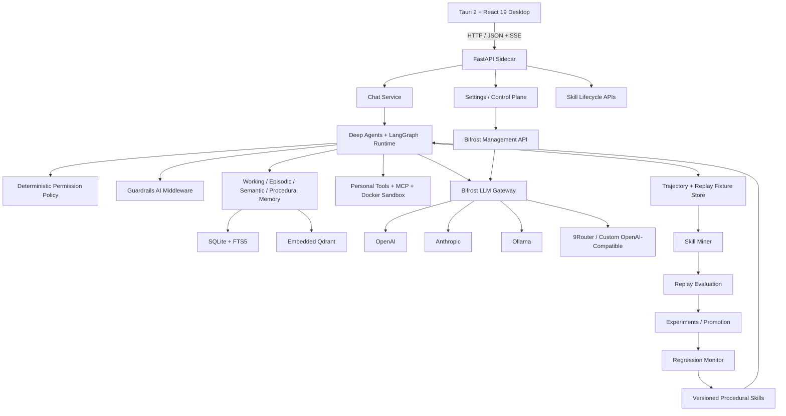

# Trajecta

**A desktop agent that learns reusable skills from successful task trajectories and only keeps what it can verify.**

Trajecta is a production-oriented AI agent system built with **LangChain Deep Agents, LangGraph, FastAPI, Tauri, React, SQLite, Qdrant, Guardrails AI, Docker, MCP, and Bifrost**.

It is designed around a simple engineering question:

> **Can an autonomous agent become measurably better at repeated tasks without blindly trusting what it learned from previous runs?**

Most agent applications stop after planning, tool use, and a final answer. Trajecta adds a second lifecycle around the agent itself: it records successful executions, identifies repeated procedures, synthesizes candidate skills, replays them in isolated evaluation environments, compares them against baseline behavior, runs controlled experiments for upgrades, monitors regressions, and promotes or rolls back skill versions based on evidence.

The result is a chat-first desktop agent with **persistent memory, configurable model providers, MCP integrations, deterministic permissions, human approvals, sandboxed execution, document RAG, scheduled autonomous tasks, and verified procedural learning**.

---

## Why this project matters

Trajecta is intentionally broader than a chatbot demo. It exercises the engineering layers that make agent systems difficult to ship reliably:

- **Stateful agent orchestration** with Deep Agents + LangGraph checkpoints.
- **Durable conversation branching** for edit, resend, regenerate, and HITL resume.
- **Multi-provider LLM infrastructure** through Bifrost rather than provider-specific application code.
- **Hybrid memory and document retrieval** using SQLite FTS5 + embedded Qdrant.
- **Guardrails at multiple boundaries** for prompt injection, secrets, PII, system-prompt leakage, and structured outputs.
- **Deterministic tool permissions** where denied tools disappear from the model's runtime surface.
- **MCP integrations with independent read-back verification** for mutating connector actions.
- **Sandboxed tool execution** with Docker resource and network controls.
- **Offline skill learning** driven by captured trajectories instead of unverified self-editing.
- **Held-out baseline-vs-candidate evaluation** before a learned skill can enter procedural memory.
- **Frequentist + Bayesian skill experiments**, automatic stopping, promotion, regression monitoring, and rollback.
- **Local-first desktop delivery** with a Tauri 2 + React 19 control surface.

For a recruiter or engineer reviewing the project, the main signal is not a single framework choice. It is the end-to-end system design: model routing, agent state, retrieval, permissions, safety, evaluation, experimentation, persistence, and desktop UX are all wired into one coherent runtime.

---

## Core idea: Verified Skill Learning

Trajecta treats successful agent runs as **evidence**, not automatically trusted knowledge.

```text
User Task
   ↓
Agent Execution
   ↓
Trajectory + Replay Fixture Capture
   ↓
Repeated Pattern Mining
   ↓
Candidate Skill
   ↓
Format + Tool-Semantics Verification
   ↓
Baseline vs Candidate Replay
   ↓
Safety + Reliability + Generalization + Improvement Gates
   ↓
Pass? ─────────────── No ──→ Reject / Keep for Review
   │
  Yes
   ↓
Initial Skill → Promote + Version
Upgrade Skill → Controlled Experiment
   ↓
Live Metrics + Regression Monitoring
   ↓
Promote Winner / Auto-Rollback Regressions
   ↓
Procedural Memory
   ↓
Future Agent Runs
```

This is the main architectural differentiator of Trajecta: **the agent is allowed to learn procedures, but learning is separated from promotion**.

### What the learning system currently implements

- Successful trajectory capture with task metadata and tool events.
- Replay-fixture capture of the initial environment needed for evaluation.
- Deterministic clustering of repeated successful task/tool patterns.
- Mining/held-out splits before candidate synthesis.
- Candidate skill bundles with instructions, workflow metadata, evaluation configuration, and source provenance.
- Structural and tool-semantics verification before evaluation.
- Isolated baseline-vs-skill replay.
- Deterministic outcome/tool-effect verification when possible, with LLM-as-judge used as a fallback rather than the first choice.
- Promotion gates across safety, reliability, generalization, and improvement.
- Immutable skill versions and rollback support.
- A/B and multi-version experiment infrastructure.
- Two-proportion frequentist testing plus a Beta-Binomial Bayesian posterior.
- Automatic experiment stopping only when the statistical evidence is sufficient.
- Automatic promotion of winning versions when configured.
- Runtime attribution of skill usage and execution metrics.
- Regression detection across success rate, latency, and tool-error behavior.
- Automatic rollback of regressed versions.
- Skill dependency graphs with cycle prevention and semantic-version constraints.

The automatic learning worker runs outside the user-facing SSE request path, so mining and evaluation do not block normal chat completion.

---

## Product experience

Trajecta is **chat-first**, not a workflow builder.

The desktop application provides:

- Persistent conversations.
- Streaming assistant responses over SSE.
- Tool/subagent activity events.
- Stop/cancel controls.
- File attachments and attachment previews.
- Large-document RAG.
- Edit, resend, and regenerate.
- Conversation branch switching.
- Human-in-the-loop approval dialogs.
- Per-conversation model selection.
- Global LLM provider/model configuration.
- Memory management.
- Embedding-model configuration.
- Guardrail settings.
- Permission settings.
- Skill lifecycle and analytics views.
- Skill experiment, version, dependency, regression, and rollback views.
- Scheduled autonomous task management.
- MCP server/tool enable-disable controls.

The UI is implemented as a **Tauri 2 desktop shell** with **React 19 + TypeScript**, React Query for server state, and Zustand for local chat/UI state.

---

## System architecture



### Three intentionally separate loops

Trajecta separates **execution**, **learning**, and **control**.

**Execution** handles live task solving: model calls, memory, tools, MCP, attachments, checkpoints, approvals, and streamed events.

**Learning** runs asynchronously from successful trajectory evidence: mining, replay, evaluation, experiments, promotion, versioning, regression monitoring, and rollback.

**Control** is deterministic and user-governed: provider settings, tool permissions, MCP preferences, guardrails, sandbox boundaries, and approval policies.

That separation is important. The model may decide _how_ to solve a task, but it does not get authority to redefine its own capability boundary or promote its own learned behavior without evaluation.

---

## Agent runtime and conversation state

Trajecta uses **LangChain Deep Agents** on top of **LangGraph**.

Each live turn is prepared before streaming begins:

1. Validate conversation and attachment state.
2. Resolve the selected model through Bifrost.
3. Discover enabled MCP tools.
4. Read a persistent permission snapshot.
5. Remove tools whose capability domain is denied.
6. Build HITL interrupt rules for tools configured as `ask`.
7. Add conversation-scoped attachment RAG when available.
8. Apply any active skill-experiment assignment.
9. Attach Guardrails AI model middleware.
10. Restore the requested LangGraph checkpoint when branching/resuming.
11. Only then open the SSE stream.

This **preflight-first streaming design** prevents a known class of chat UX failures where an HTTP 200/SSE stream is opened before validation discovers that the run cannot actually start.

### Checkpoint-backed branching

Messages are immutable. Editing or regenerating does not overwrite history.

Trajecta forks execution from the relevant LangGraph checkpoint, producing a new application branch with its own branch head. That enables:

- Edit a user message and continue from the prior state.
- Resend without destroying the original path.
- Regenerate an assistant response from the same checkpoint.
- Switch back to previous branches.
- Resume human-approval interruptions from persisted state.

This makes the chat history reproducible enough to support downstream trajectory analysis and skill experiments.

---

## LLM gateway: Bifrost as the permanent data plane

Trajecta does not hardcode OpenAI, Anthropic, Ollama, or 9Router into the agent runtime.

All chat model calls follow this path:

```text
Deep Agents / LangChain Chat Model
              ↓
            Bifrost
              ↓
     selected provider/model
```

The agent uses Bifrost's OpenAI-compatible `/v1` surface while Bifrost owns provider routing, credentials, governance, model discovery, and provider-specific translation.

### Runtime-configurable providers

The desktop **Settings → LLM Providers** page is a control plane for Bifrost. It supports:

- OpenAI.
- Anthropic.
- Ollama.
- 9Router.
- Custom OpenAI-compatible providers.

The FastAPI backend uses a dedicated `BifrostAdminClient` to create/update/remove providers, list provider models, test connectivity, and ensure Trajecta's virtual key is allowed to use newly configured providers.

Provider credentials are forwarded to Bifrost and are **not stored in Trajecta's `agent_settings` table**.

Trajecta persists only the user's runtime preference:

```json
{
  "gateway": { "type": "bifrost" },
  "default_provider": "anthropic",
  "default_model": "anthropic/claude-..."
}
```

The global default applies to **new conversations**. Existing conversations retain the model they started with, which keeps branches and evaluations reproducible.

---

## Memory and retrieval

Trajecta does not treat all memory as one vector collection.

It separates four memory roles:

- **Working memory** — in-run task/context state.
- **Episodic memory** — previous conversations and execution history.
- **Semantic memory** — durable user/project facts.
- **Procedural memory** — promoted, versioned skills.

### Hybrid semantic retrieval

Semantic retrieval combines:

- **SQLite FTS5** for exact lexical matches.
- **Embedded Qdrant** for vector similarity.

This matters for agent memory because exact identifiers and semantic paraphrases need different retrieval behavior.

### Local embedding configuration

The desktop can discover embedding-capable models installed in **Ollama**, probe a selected model, determine vector dimensions, switch the active embedder, and re-index stored memories/attachment chunks.

If no Ollama embedding model is enabled, the application falls back to its built-in placeholder embedder rather than silently pretending high-quality semantic retrieval is available.

---

## Large-document RAG and attachments

Uploaded files remain the canonical source. RAG is a retrieval optimization, not a replacement for file inspection.

For large extracted documents:

```text
Upload
  ↓
Extract text companion
  ↓
Chunk with overlap
  ↓
SQLite attachment_chunks
  ↓
FTS5 lexical index + Qdrant vector index
  ↓
Conversation-scoped search_attachments tool
  ↓
Deep Agent retrieves only relevant passages
```

Supported document/media tooling includes PDF, DOCX, XLSX, PPTX, CSV, HTML, OCR/image operations, archives, local media conversion, transcription, and speech utilities. Scanned/image-only PDFs still require OCR or multimodal inspection; Trajecta does not claim extracted text when none exists.

---

## Guardrails and deterministic permissions

Trajecta intentionally separates **content safety** from **tool authority**.

### Guardrails AI

The current runtime wires Guardrails AI checks into chat boundaries, including configurable support for:

- Prompt-injection detection.
- Jailbreak detection.
- Secret detection.
- PII detection.
- System-prompt leakage detection.
- Structured JSON validation for internal model outputs.

User prompts and untrusted retrieved/tool content can be handled differently. For example, a suspicious user prompt may generate a warning while injected instructions inside retrieved content can be blocked.

### Deterministic capability policy

Sensitive actions are governed separately by a persisted `allow / ask / deny` policy.

Capability domains include filesystem writes, terminal execution, browser actions, computer control, external communication, and network mutations.

The enforcement model is deliberately stronger than a prompt instruction:

- **deny** — matching tools are removed before the model sees the runtime tool surface.
- **ask** — the tool remains available but Deep Agents interrupts before execution and waits for a human decision.
- **allow** — the tool may execute without that approval gate.

Deep Agents filesystem permissions are also projected from the same policy, and `/uploads/**` plus `/skills/**` remain protected against direct writes.

The language model is never the authority that decides whether it may bypass this boundary.

---

## MCP and independent action verification

Trajecta supports MCP through LangChain's MCP adapter.

The user can enable/disable entire MCP servers or individual tools from Settings. Discovery failures are isolated so one broken server does not invalidate every configured integration.

For mutating connector actions, Trajecta adds a separate verification layer: a connector's success response is **not automatically treated as proof that the external state changed**. Where a verification rule exists, the system performs an independent read-back and stores a receipt.

This design reduces false-positive “done” responses from external tools and creates a better audit trail for autonomous actions.

---

## Built-in agent capabilities

Trajecta includes dozens of local/personal-agent tools in addition to Deep Agents' built-in filesystem/task primitives.

Capability areas include:

- Semantic memory search/read/write/delete.
- Session search and previous-conversation retrieval.
- Skill discovery and candidate management.
- Trajectory search.
- Persistent personal tasks.
- One-time, interval, and cron schedules.
- In-app notifications.
- Web search, HTTP, extraction, and RSS.
- Browser automation.
- Optional host-computer control.
- Document reading/search/extraction.
- OCR and image transforms.
- Archive create/extract.
- SQLite querying/mutation.
- Local process management.
- Media conversion.
- Local speech/transcription utilities.
- Clipboard/system utilities.
- MCP-provided external tools.
- Docker-sandboxed code/command execution.

Host computer control is opt-in. Sandboxed execution can run with restricted filesystem access, resource limits, and networking disabled.

---

## Autonomous scheduling

Trajecta includes a persistent scheduler for one-time, interval, and cron jobs.

Scheduled jobs execute through the **same chat/agent runtime** used for interactive requests. They therefore inherit the same model routing, memory, tools, guardrails, permissions, trajectory capture, and skill-attribution logic.

If a scheduled run reaches a sensitive operation that requires approval, the run pauses instead of bypassing the user's policy.

---

## Skill experiments and regression control

A verified initial skill can be promoted after evaluation. Upgrades can instead enter an online experiment.

Experiment infrastructure includes:

- Sticky assignment by unit/conversation thread.
- Control and treatment arms.
- Multi-version arm support.
- Configurable treatment traffic.
- Minimum and maximum sample sizes.
- Minimum effect thresholds.
- Frequentist two-proportion evidence.
- Bayesian Beta-Binomial posterior probabilities.
- Deterministic Monte Carlo seeding for stable/reproducible analyses.
- Automatic stopping.
- Automatic winner promotion.

Automatic decisions are intentionally conservative: success-rate promotion/regression logic can require the frequentist and Bayesian readings to agree instead of promoting a version based on one lucky streak.

After promotion, the regression monitor can compare the live version with its stable predecessor. It monitors success-rate degradation as well as operational regressions such as latency blow-ups or increased tool-error rates, writes the detection before attempting rollback, and can automatically restore a stable version.

---

## Persistence model

Trajecta keeps application state local by default.

The main SQLite store uses WAL mode and sequential schema migrations. The current implementation includes **14 schema versions**, covering:

- Task/trajectory/skill/memory metadata.
- Production chat persistence.
- Conversation branches and attachment RAG.
- Per-branch LangGraph thread IDs.
- Personal tasks, schedules, notifications, and audit state.
- Durable HITL approvals.
- Skill versions and evaluations.
- Replay fixtures.
- Action receipts and connector verification.
- MCP preferences.
- Permission and agent settings.
- Skill-learning coordinator state.
- Experiment metrics and regression records.
- Experiment arms/assignments and skill dependency graphs.

LangGraph checkpoint/state storage is kept separate from Trajecta's application database so each system owns its own persistence contract.

---

## API surface

The FastAPI sidecar exposes versioned routes under `/api/v1`.

Major API groups include:

- `/chat` — conversations, streaming turns, attachments, cancel, branch operations, edit/resend/regenerate, model changes, approval resume.
- `/models` — Bifrost-backed model catalog.
- `/llm` — gateway state, provider configuration, provider models, connection tests, global defaults.
- `/memory` — semantic/episodic memory, automatic-memory settings, embedding configuration.
- `/permissions` — deterministic capability modes.
- `/guardrails` — content/privacy guardrail configuration.
- `/tools` — built-in tools, MCP preferences, connector verification receipts.
- `/tasks` — scheduled autonomous jobs.
- `/skills` — candidates, evaluation, promotion, versions, experiments, analytics, dependencies, regression checks, rollback, and learning status.
- `/health` — backend health.

The `/traces` route is reserved for the observability layer described in the status section below.

---

## Repository structure

```text
Trajecta/
├── apps/
│   └── desktop/
│       ├── src/
│       │   ├── components/
│       │   │   ├── settings/       # LLM, embeddings, guardrails, permissions, memory, skills, MCP, schedules
│       │   │   └── skills/         # experiments, analytics, dependencies, versions, rollback
│       │   ├── hooks/
│       │   ├── lib/
│       │   ├── stores/
│       │   ├── styles/
│       │   └── types/
│       └── src-tauri/              # Tauri 2 desktop shell
│
├── server/
│   ├── src/
│   │   ├── api/                    # FastAPI app + versioned routes
│   │   ├── agent/                  # agent/runtime support modules
│   │   ├── chat/                   # chat service, branching, RAG, streaming, model runtime, MCP
│   │   ├── config/                 # typed configuration
│   │   ├── guardrails/             # Guardrails AI + deterministic permission policy
│   │   ├── llm_gateway/            # Bifrost control plane + provider/default settings
│   │   ├── memory/                 # working/episodic/semantic/procedural stores
│   │   ├── observability/          # observability design/handoff
│   │   ├── skills/                 # mining, replay, eval, experiments, analytics, versioning, rollback
│   │   └── tools/                  # personal, MCP, sandbox, built-in, verification
│   └── tests/                      # pytest coverage for critical subsystems
│
├── config/
│   ├── bifrost/                    # Bifrost seed/config store
│   ├── default.yaml                # Trajecta runtime configuration
│   └── guardrail-rules.yaml
│
├── evals/                          # evaluation requirements/results location
├── infra-docker/                   # sandbox + infrastructure definitions
├── docker-compose.yaml             # Bifrost + Qdrant development services
├── Trajecta_Project_Spec.md
└── pyproject.toml
```

---

## Technology stack

**Desktop**

- Tauri 2
- React 19
- TypeScript
- Vite
- TanStack React Query
- Zustand

**Agent runtime**

- LangChain Deep Agents
- LangGraph
- LangGraph SDK
- LangChain MCP

**Backend**

- Python 3.11+
- FastAPI
- Uvicorn
- Pydantic v2
- asyncio / SSE

**LLM infrastructure**

- Bifrost gateway
- OpenAI
- Anthropic
- Ollama
- 9Router
- Generic OpenAI-compatible providers

**Memory and retrieval**

- SQLite
- FTS5
- Qdrant
- Ollama local embeddings

**Safety and execution**

- Guardrails AI
- Deep Agents permissions / HITL
- Custom deterministic permission policy
- Docker sandbox
- MCP connector verification

**Evaluation and learning**

- Replay fixtures
- Baseline-vs-candidate evaluation
- Deterministic outcome/tool-effect verification
- LLM-as-judge fallback
- Frequentist two-proportion testing
- Bayesian Beta-Binomial analysis
- Skill versioning, dependency graphs, regression detection, rollback

---

## Getting started

### Prerequisites

- Python 3.11+
- `uv`
- Node.js 18+
- `pnpm`
- Docker / Docker Compose
- Optional: Ollama for local inference and local embeddings

### 1. Clone and configure environment

```bash
git clone <your-repository-url>
cd Trajecta

cp .env.example .env
```

At minimum, ensure the Bifrost virtual key used by the Python application matches the key configured for Trajecta in Bifrost:

```env
BIFROST_URL=http://127.0.0.1:8080
BIFROST_VIRTUAL_KEY=sk-bf-trajecta
```

The repository seeds a `9router` provider for local development. If you use that seed, also configure its credential in `.env`. Otherwise, providers can be added from the desktop **LLM Providers** settings page after Bifrost starts.

### 2. Start Bifrost

```bash
docker compose up -d bifrost
```

Bifrost listens on `http://127.0.0.1:8080` by default.

The root Docker Compose file also includes a standalone Qdrant service for development, although Trajecta's default memory configuration uses embedded Qdrant locally.

### 3. Install and run the backend

```bash
uv sync
uv run python -m uvicorn server.src.api.app:app --host 127.0.0.1 --port 8420
```

The API is available at:

```text
http://127.0.0.1:8420/api/v1
```

### 4. Run the desktop application

```bash
cd apps/desktop
pnpm install
pnpm tauri dev
```

For browser-only frontend development:

```bash
pnpm dev
```

For a production desktop build:

```bash
pnpm tauri build
```

### 5. Configure model providers from the UI

Open:

```text
Settings → LLM Providers
```

From there you can:

- Verify Bifrost connectivity.
- Configure OpenAI, Anthropic, Ollama, 9Router, or a custom OpenAI-compatible endpoint.
- Test an individual provider.
- Discover provider models.
- Choose the default provider/model for new conversations.

Bifrost remains the gateway regardless of which provider is selected.

### 6. Optional: configure a local embedding model

Open:

```text
Settings → Embedding
```

Trajecta discovers embedding-capable models installed in local Ollama, validates the selected model, and can re-index stored semantic memory and attachment chunks.

---

## Configuration

Primary configuration lives in `config/default.yaml`.

Important sections:

- `server` — FastAPI host/port.
- `llm` — Bifrost bootstrap configuration.
- `memory` — SQLite, LangGraph, Qdrant, memory paths, and vector-store settings.
- `skills.learning` — automatic learning thresholds and mining behavior.
- `skills.experiments` — traffic allocation, statistical thresholds, sample limits, auto-stop/promotion.
- `skills.regression` — live regression thresholds and auto-rollback.
- `skills.fixtures` — replay-fixture capture limits and exclusions.
- `guardrails` — content validators and HITL behavior.
- `sandbox` — Docker image, time, CPU, memory, and networking limits.
- `chat` — uploads, bootstrap model, heartbeat, RAG chunking and retrieval limits.
- `tools` — browser/computer/scheduler/MCP settings and connector verification.
- `observability` — reserved OTLP/service configuration for the remaining observability integration.

User-selected defaults and UI-controlled runtime settings are persisted in SQLite, so normal settings changes do not require editing YAML by hand.

---

## Testing

The repository currently contains **17 pytest modules** covering critical backend behavior, including:

- Attachment ingestion and RAG-related behavior.
- Conversation persistence and branching.
- Default-model persistence.
- Guardrail content and structured-output handling.
- Bifrost administration and LLM settings routes.
- Embedding model switching.
- Skill learning lifecycle.
- Skill attribution and analytics.
- Experiment service behavior and statistical calculations.
- Runtime encoding regression coverage.

Run backend tests with:

```bash
uv run python -m pytest server/tests -q
```

Build/type-check the frontend with:

```bash
cd apps/desktop
pnpm build
```

The frontend build runs TypeScript checking before Vite compilation.

---

## Current project status

The **core product loop is implemented**:

- Desktop chat UI.
- Persistent conversations and streaming.
- Checkpoint-backed branching.
- Attachments and large-document RAG.
- Deep Agents / LangGraph runtime.
- Bifrost-only model gateway with runtime-configurable providers.
- Local Ollama embedding selection.
- Working, episodic, semantic, and procedural memory.
- MCP discovery/preferences and connector verification.
- Deterministic permissions and HITL approvals.
- Guardrails AI content checks.
- Docker sandbox integration.
- Personal-agent tool runtime.
- Scheduled autonomous jobs.
- Trajectory/replay-fixture capture.
- Automatic skill mining and held-out evaluation.
- Skill promotion/versioning.
- Online skill experiments.
- Frequentist + Bayesian experiment analysis.
- Skill analytics and attribution.
- Dependency management.
- Regression monitoring and automatic rollback.

### Remaining production-hardening work

The largest intentionally unfinished infrastructure slice is **full OpenTelemetry runtime instrumentation and the Grafana/Tempo/Loki/Prometheus pipeline**.

The project already declares the OpenTelemetry dependencies and configuration intent, but the repository does not yet contain the runtime tracer/exporter wiring. The `/traces` API is also currently a placeholder. This is deliberately documented as remaining work rather than presented as implemented functionality.

Additional release hardening that would be appropriate before calling the application generally available includes automated release/CI packaging and broader end-to-end testing across desktop, Bifrost, sandbox, Ollama, and external MCP providers.

---

## Engineering principles used in Trajecta

**Evidence before autonomy.** A successful model/tool response is not automatically a verified state change or a verified skill.

**The LLM is not the permission system.** User policy determines the tool surface; the model operates inside that boundary.

**Learning is offline and gated.** Trajecta does not rewrite its production behavior directly from one live run.

**State should be reproducible.** Checkpoints, immutable message history, branches, replay fixtures, model persistence, and versioned skills all support repeatability.

**Local-first should be architectural, not cosmetic.** Conversations, memory, skills, schedules, settings, evaluation metadata, and most retrieval state are stored locally.

**Provider choice should not leak into application logic.** Bifrost is the stable gateway contract; provider configuration is a control-plane concern.

**Safety and quality are different problems.** Guardrails validate content; deterministic policy governs authority; evaluation measures whether learned behavior is actually better.

---

## Documentation

Detailed subsystem handoffs are included in the repository:

- `Trajecta_Project_Spec.md` — product architecture and engineering thesis.
- `server/REQUIREMENTS.md` — backend requirements.
- `apps/desktop/REQUIREMENTS.md` — desktop requirements.
- `server/src/memory/REQUIREMENTS.md` — memory architecture.
- `server/src/skills/REQUIREMENTS.md` — verified skill-learning architecture.
- `server/src/guardrails/REQUIREMENTS.md` — safety/guardrail design.
- `server/src/llm_gateway/REQUIREMENTS.md` — gateway architecture.
- `server/src/observability/REQUIREMENTS.md` — planned observability layer.
- `server/src/tools/REQUIREMENTS.md` — tool runtime and MCP design.
- `evals/REQUIREMENTS.md` — evaluation requirements.
- `infra-docker/REQUIREMENTS.md` — sandbox/infrastructure requirements.

---

## Project thesis

Trajecta is ultimately an experiment in **controlled agent improvement**.

A capable autonomous system should be able to benefit from experience, but production software should not accept self-generated procedures simply because an LLM says they are useful. Trajecta therefore turns experience into a measurable software lifecycle:

```text
experience
  → candidate procedure
  → isolated verification
  → comparative evaluation
  → controlled rollout
  → live measurement
  → promotion or rollback
```

That is the core of the project: **an autonomous agent that can learn, while keeping evidence, versioning, permissions, and rollback between experience and production behavior.**

---

## License

MIT License. See [`LICENSE`](LICENSE).
