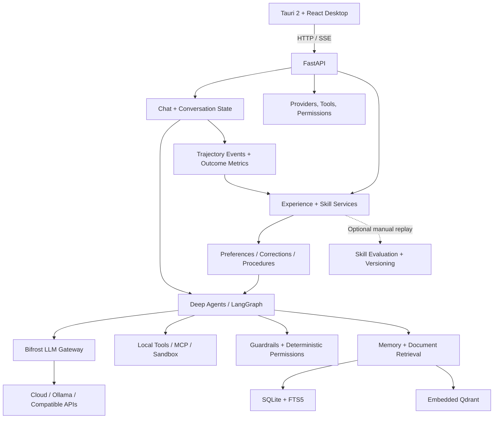

# Trajecta

**A local-first, chat-first desktop agent that learns from real experience.**

Trajecta combines **LangChain Deep Agents and LangGraph** with persistent memory, local and hosted LLMs, practical tools, and human-controlled permissions. It is built to become more useful over time by remembering explicit preferences, incorporating feedback, and reusing evidence-linked procedures—without running an expensive benchmark every time a conversation ends.

> **Project status:** Active development. The repository implements the core desktop/chat, tools, memory, and experience-learning paths described below. Some advanced evaluation infrastructure remains accessible through backend APIs; full OpenTelemetry/Grafana observability and release-grade end-to-end validation are still in progress.

## At a glance

- **Desktop-first:** Tauri 2, React 19, TypeScript, streaming chat, conversations, and model selection.
- **Agentic execution:** Deep Agents + LangGraph with tools, subagents, checkpoints, cancellation, and durable human-in-the-loop resume.
- **Your workspace:** Select a different local project folder for each conversation.
- **Experience-first learning:** Learn explicit preferences, capture corrections, and reuse user-confirmed procedures; review uncertain or sensitive discoveries.
- **Persistent retrieval:** SQLite + FTS5 for structured/exact search, and embedded Qdrant for semantic search.
- **Model choice:** Bifrost connects the agent to OpenAI, Anthropic, Ollama, 9Router, and other OpenAI-compatible providers.
- **Controlled tool use:** MCP tools, local utilities, optional Docker sandboxing, content guardrails, and deterministic `allow / ask / deny` permissions.
- **Personal automation:** One-time and recurring scheduled agent tasks, with approvals retained for sensitive actions.

## Why Trajecta exists

A conventional agent can answer questions and operate tools. Trajecta also maintains the context needed to make the **next** interaction more effective: user preferences, past attempts, corrections, task outcomes, and reusable procedures.

The design separates three responsibilities:

1. **Execution:** Solve the current task quickly using the chosen model, tools, memory, and workspace.
2. **Learning:** Retain useful evidence from actual interactions and incorporate user corrections without automatically re-running entire tasks.
3. **Control:** Keep model decisions inside deterministic tool permissions, review workflows, and independent action verification.

Learning is not the same as proving that a model has improved on a benchmark. Trajecta treats routine experience capture as a low-cost operation, and reserves replay-based evaluation for explicit diagnostics or higher-risk skill changes.

## What you can do

### Chat and work in local folders

The desktop client supports:

- Persistent conversations and **SSE token streaming**.
- Tool and subagent activity with expandable inputs/results.
- An optional reasoning/activity view for **reasoning text actually provided by the selected model or gateway**. Trajecta does not reconstruct private model reasoning if the provider does not expose it.
- Message editing, resend, regeneration, and switching between LangGraph-backed conversation branches.
- File uploads, extracted-text companions, previews, and large-document retrieval.
- Per-conversation provider/model selection, stopping an active run, and resuming interrupted operations.
- A **folder selector** that binds `/workspace/` to the selected host directory for that conversation. The backend validates the directory and does not silently substitute a different folder if a selected path becomes inaccessible.
- **Human questions** (for missing information or choices) distinguished from **permission requests** (for sensitive tool actions).

### Use practical tools

Alongside Deep Agents' file and task primitives, Trajecta contains personal-agent tools for:

- Web search, HTTP extraction, RSS, and browser automation.
- Document extraction/search, spreadsheets, images/OCR, archives, and media conversion.
- Sessions and memory, local databases, processes, clipboard/system utilities, and notifications.
- Scheduled jobs and optional host-computer control.
- External integrations discovered through the **Model Context Protocol (MCP)**, with user-controlled server/tool availability.
- Isolated command or code execution where the configured Docker backend is used.

Tool availability depends on local dependencies, platform, configuration, and permission policy. Host-computer control is opt-in; **not every operation is automatically sandboxed**.

Web-source failures such as HTTP 403, timeouts, or connection errors are surfaced to the agent as recoverable errors for supported web tools. The runtime directs it to search for independent sources rather than repeatedly retrying an inaccessible URL or inventing its contents.

## How the system fits together



### Agent runtime and conversation history

Trajecta validates the conversation, attachments, selected workspace, model configuration, enabled MCP tools, permissions, and applicable checkpoint **before opening the response stream**. LangGraph checkpoints support edits, regenerations, and interrupted approval flows without overwriting the original message history.

Streaming sends response text as model chunks arrive. Trajectory capture stores activity in append-only event records rather than repeatedly rewriting the entire event history. Replay-fixture/workspace snapshots are **disabled by default** for ordinary chat, reducing work before the first response.

## Experience-first learning

Trajecta's current learning path focuses on **real interactions**, not automatic candidate-versus-baseline tournaments.

```text
Real conversation / task
         |
         v
Capture message, tool activity, outcome, and feedback
         |
         +--> Explicit response preference --> Active learned experience
         |
         +--> User correction -----------> Needs review
         |
         +--> User-confirmed task --------> Procedure suggestion
                                           |              |
                                    Read-only        Risky/unknown
                                           |              |
                                         Active       Needs review
                                           \              /
                                            v            v
                                      Relevant future context
                                               |
                                      Observe more outcomes
```

### What is recorded

- **Preferences:** Explicit response-style instructions can be stored without an extra evaluation-model call.
- **Corrections:** Potential corrections are kept for review instead of silently being treated as authoritative facts.
- **Confirmed procedures:** Helpful feedback on a completed run can produce a short record of the task and tools observed. A record involving unknown or potentially mutating tools requires review.
- **Revisions:** Learned experiences have version history and rejected entries remain archived rather than being silently reactivated.
- **Evidence and attribution:** The system retains links to source trajectories and captures model/tool execution metrics.

**Completion is not success.** A normal assistant response produces a `completed` trajectory and a metrics record, but its outcome is **unverified** until separate evidence or user feedback establishes success or failure. Unverified completions do not enter verified-success statistics.

The Skills page is organized around **Learned**, **Improved**, **Needs review**, **Rejected**, and **Saved skills**. It surfaces prior candidates for review without automatically running their old evaluation workflow.

### What remains optional

Trajecta retains an optional skill-mining module (not wired into the running app), replay fixtures, manual baseline-versus-candidate evaluation, versioning, dependency checks, configuration-gated statistical experiments, regression analysis, and rollback. These are **advanced/manual or configuration-gated capabilities**, not the default path for everyday experience learning.

In `config/default.yaml`, the default settings include:

```yaml
skills:
  experiments:
    enabled: false
  fixtures:
    enabled: false
    capture_workspace: false
```

The legacy automatic mining/evaluation worker and its chat hooks have been removed. The old `/skills/learning/status` and `/skills/learning/run` endpoints return HTTP 410 for stale clients. An explicitly requested manual candidate evaluation or upgrade can still use model tokens and replay infrastructure. Experience records **do not** grant tool permissions or automatically rewrite an active executable skill.

## Memory, RAG, and embeddings

Trajecta distinguishes four memory roles:

- **Working memory:** The active task and LangGraph execution state.
- **Episodic memory:** Previous interactions, trajectories, and task history.
- **Semantic memory:** Reusable factual context and preferences.
- **Procedural memory:** Saved skills and reusable procedures.

The storage layers have different jobs:

- **SQLite:** Durable application records, chat history, settings, skill metadata, feedback, jobs, audit trails, and schema migrations.
- **SQLite FTS5:** Lexical search for names, exact strings, and document content.
- **Embedded Qdrant:** Vector-based semantic retrieval. A separate Qdrant container is available for development but is not required by the default embedded configuration.

The desktop can discover supported **Ollama embedding models**, select one, and reindex memory and attachment chunks. Without a configured real embedding model, the built-in fallback does **not** provide equivalent semantic quality.

For large text-based uploads, Trajecta extracts text, chunks it, indexes it in FTS5 and Qdrant, and exposes a conversation-scoped `search_attachments` tool. The original attachment remains the source of truth. Scanned PDFs and visual layouts require OCR or suitable visual inspection; text extraction alone is not visual verification.

## Models and Bifrost

The normal model path is:

```text
Deep Agents / LangChain
          |
          v
   Bifrost gateway
          |
          +-- OpenAI
          +-- Anthropic
          +-- Ollama
          +-- 9Router
          +-- Custom OpenAI-compatible endpoint
```

**Settings → LLM Providers** manages configured providers, connections, available models, and defaults via Bifrost's management API. Provider credentials are managed by Bifrost instead of being written into Trajecta's ordinary settings records.

A global default applies to **new** conversations. Existing conversations retain their own selected model unless changed explicitly. Ollama can provide local inference, while cloud provider requests may transmit prompts or context externally.

## Safety, approvals, and verification

Trajecta separates **content inspection** from **authority to act**:

- **Content guardrails** inspect applicable user, tool, retrieved-document, or cloud-bound model context for configured risks such as prompt injection, secrets, and PII. Structured internal responses have separate validation utilities.
- **Deterministic permissions** use `allow`, `ask`, and `deny`. Denied personal tools are filtered out before the agent receives them; `ask` actions interrupt for explicit user approval.
- **Human questions** use an `ask_user` flow independent of approving an action.
- **MCP settings** enable or disable servers and individual tools. Some mutating connector actions can be checked with an independent read-back receipt instead of trusting a tool's success message alone.
- **Docker sandboxing** is available for supported execution paths, with configurable time, CPU, memory, filesystem, and network restrictions.

There is no blanket claim of output-side LLM filtering: the current `GuardrailsModelMiddleware` operates **before** model calls. A guardrail warning is not permission to perform a blocked operation.

## Scheduled tasks

Trajecta persists one-time, interval, and cron schedules. Scheduled tasks reuse the normal chat/agent runtime and its model selection, tools, memory, and permission policy. If a scheduled operation needs approval, it pauses rather than bypassing the user's settings.

## Get started

### Prerequisites

- **Python 3.11+** and [`uv`](https://docs.astral.sh/uv/).
- **Node.js**, **pnpm**, and the **Rust/Tauri development prerequisites** for your operating system.
- **Docker + Docker Compose** for the supplied Bifrost stack and optional sandbox services.
- Optional: **Ollama** for locally hosted models and embeddings.

Some personal tools require extra host dependencies (for example, browser automation, OCR, audio, or GUI utilities). Their installation and behavior vary by platform.

### 1. Configure the project

Use the current Trajecta source checkout (or the extracted project archive). If cloning from a remote repository, first make sure that branch contains this implementation; an older published branch may not yet include the changes described here.

From the project root:

```bash
cp .env.example .env
```

On Windows PowerShell, use `Copy-Item .env.example .env` in place of `cp` if necessary.

Review `.env` and `config/bifrost/` before starting. Ensure the application's `BIFROST_VIRTUAL_KEY` matches the virtual key configured in Bifrost. If you use a 9Router provider, supply its real credential through your local configuration; never commit secrets.

### 2. Start the LLM gateway

```bash
docker compose up -d bifrost
```

By default, Bifrost is served at `http://127.0.0.1:8080`. The root compose file also defines a standalone Qdrant service; Trajecta's default vector store is embedded and does not require that service.

### 3. Start the Python backend

From the repository root:

```bash
uv sync
uv run python -m server.src.main
```

The configured default API origin is `http://127.0.0.1:8420`, with routes under `/api/v1`. The `server.src.main` entry point includes a Windows UTF-8 startup safeguard.

### 4. Start the desktop app

In another terminal:

```bash
cd apps/desktop
pnpm install
pnpm tauri dev
```

For browser-only UI development, run `pnpm dev` instead. Native folder selection requires the Tauri desktop app.

In the app, open **Settings → LLM Providers**, confirm gateway connectivity, configure an available provider/model, and choose a default. For better local retrieval, select a compatible model under **Settings → Embedding**.

### Common development commands

```bash
# Run all backend tests (repository root)
uv run python -m pytest server/tests -q

# Frontend unit tests
cd apps/desktop
pnpm test

# Frontend TypeScript check + Vite build
pnpm build

# Desktop production build (requires Tauri platform prerequisites)
pnpm tauri build
```

These commands are provided from the repository configuration; **they are not a claim that the full test or packaging suite has passed on every platform**.

## Configuration and project layout

The default configuration is `config/default.yaml`, with local overrides supported through `.trajecta/config.yaml` and environment variables as implemented by the settings loader. The desktop stores user-controlled runtime preferences in local application storage.

```text
Trajecta/
├── apps/desktop/
│   ├── src/                 # React UI, streaming chat, learning and settings
│   └── src-tauri/           # Tauri 2 shell
├── server/
│   ├── src/
│   │   ├── api/             # Versioned FastAPI routes
│   │   ├── chat/            # Runtime, persistence, SSE, workspace, branching, RAG
│   │   ├── agent/           # Agent support and HITL primitives
│   │   ├── memory/          # SQLite, FTS5, Qdrant, memory and embeddings
│   │   ├── skills/          # Experience learning, metrics and optional evaluation
│   │   ├── tools/           # Personal tools, MCP, sandbox, connector verification
│   │   ├── guardrails/      # Content inspection and deterministic policy
│   │   └── llm_gateway/     # Bifrost integration and provider settings
│   └── tests/              # Backend regression tests
├── config/                 # Default config, Bifrost, guardrail rules
├── infra-docker/           # Infrastructure and sandbox definitions
├── docker-compose.yaml     # Bifrost + optional standalone Qdrant
├── pyproject.toml          # Python dependencies and tools
└── README.md
```

### Key API groups

The FastAPI backend serves endpoints under `/api/v1`:

- `/chat` — conversations, SSE streaming, attachments, branch operations, workspace selection, model selection, and approval resume.
- `/models` and `/llm` — available models and Bifrost provider settings.
- `/memory` — memory records and embeddings.
- `/learning` — feedback, learned experiences, reviews, and consolidated Skills overview.
- `/skills` — saved skills plus legacy/manual evaluations, experiments, analytics, and versions.
- `/permissions`, `/guardrails`, `/tools` — capability policy, content settings, MCP, and action verification receipts.
- `/tasks` — persisted personal tasks and schedules.
- `/health` — service health.

## Current scope and limitations

**Implemented in the uploaded source:** Chat streaming, checkpoint-backed branches, local workspaces, attachments/RAG, provider configuration, memory, permissions/HITL, personal and MCP tools, scheduler paths, feedback-driven experience storage, skill versioning, and execution metrics.

**Retained but not the default workflow:** The standalone skill miner, replay evaluation, online experiments, and regression/rollback code. Mining no longer has an active endpoint; explicit candidate evaluation and other manual/opt-in APIs remain available. Normal conversations do not automatically run an evaluation campaign.

**Not yet a complete production observability stack:** OpenTelemetry dependencies and observability documentation exist, but end-to-end instrumented traces/exporters and the Grafana/Tempo/Loki/Prometheus integration are not wired into the runtime. The `/traces` router is currently a placeholder.

**Still needs release hardening:** Desktop/backend packaging, platform-specific tool installation, full end-to-end validation, performance profiling under realistic workloads, and thorough integration testing across Bifrost, Ollama, sandboxed actions, and external MCP servers.

Trajecta is **local-first**, not guaranteed offline or inherently safe for unrestricted host execution. Actual privacy and security depend on the chosen provider, enabled tools, sandbox setup, and permission configuration.

## Further documentation

- [Desktop requirements](apps/desktop/REQUIREMENTS.md)
- [Backend requirements](server/REQUIREMENTS.md)
- [Memory architecture](server/src/memory/REQUIREMENTS.md)
- [Skills and learning](server/src/skills/REQUIREMENTS.md) — includes older evaluation-first design details; use the current implementation and this README for active defaults.
- [Guardrails and permissions](server/src/guardrails/REQUIREMENTS.md)
- [LLM gateway](server/src/llm_gateway/REQUIREMENTS.md)
- [Tool runtime](server/src/tools/REQUIREMENTS.md)
- [Observability plan](server/src/observability/REQUIREMENTS.md)
- [Infrastructure requirements](infra-docker/REQUIREMENTS.md)

## License

[MIT License](LICENSE).
